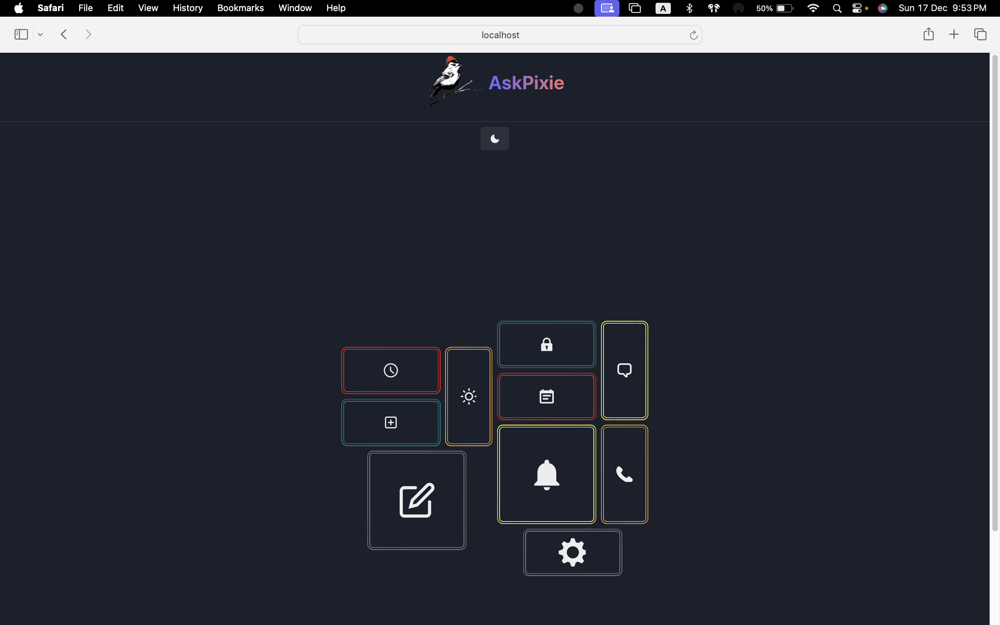
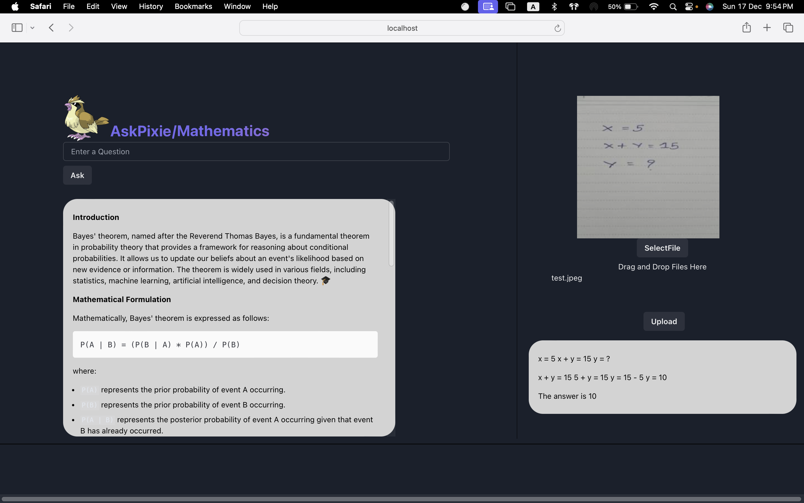

# Askpixie 🐦

**Language**: Python  
**Framework**: [Reflex](https://reflex.dev/docs)  

AskPixie: Unleashing Knowledge, Python-Powered. Harnessing Google's Gemini API for Smart Learning. Explore Topics, Upload Images, Dive into Learning Delight!

## Overview 🚀

AskPixie is a comprehensive educational platform designed to facilitate seamless learning experiences for students. Built entirely using Python, it leverages Google's Gemini API to offer a wide array of features and functionalities. Users can delve into various subjects and topics, accessing reference links, detailed introductions, and practical examples. One of its standout features is the ability to upload images for precise topic-based answers, enhancing learning efficiency. AskPixie empowers students by providing a user-friendly interface, rich educational resources, and innovative tools for an enriched learning journey.

## How it Works 💡

1. Select a domain from the Home Page.
2. Enter any question/query related to the domain topic.
3. The Generative AI will Give you Introduction, Examples,codes(if needed) and Reference Links of topic.
4. If You want to analyze any Image related to topic, upload it using selectfile(button) and get an Analysis or Answer of the Image.

### Quick Insights 👊

The Current Project uses Gemini-pro for text generation and Gemini-pro-vision for Image Analysis using the respected APIs.


## 🚀 Getting Started  

### Open Using Daytona  

1. **Install Daytona**: Follow the [Daytona installation guide](https://www.daytona.io/docs/installation/installation/).
  
2. **Create the Workspace**: (by adding git provider)
   ```bash  
   daytona create https://github.com/Vr978/DAYTONA-ASKPIXIE.git --devcontainer-path=.devcontainer/devcontainer.json
   ```
3. **Add Gemini Key in Project Configuration**: Add GEMINI_API_KEY="your_api_key" in environment variable.
   ```bash
   ./daytona project-config add
   ```   
4. **Install the dependencies**
```bash
   reflex init
```
5. **Run the app**
```bash
   reflex run --loglevel debug
```
Note : Must have Gemini API key to run the app, you can create [here](https://ai.google.dev/).

---

## ✨ Features  

### Domain Specific 💪 💪

Explore Precision Learning with AskPixie! Choose Your Domain – Math or History or CyberSecurity or Whatever, Get Laser-Focused Answers. Crafted by Prompt Engineering, Empowered by Google's Gemini API. Dive Deep, Learn Smart!

### Image Analysis and Text Output 🖼

AskPixie's Image Analysis & Text Output, powered by Gemini Pro Vision, interprets uploaded images, extracts key text, and delivers precise academic information tailored to the chosen subject, enriching learning through visual exploration and focused textual explanations.

## Upcoming Features 🏃

1.Exciting Upgrades Ahead for AskPixie! 🚀 Get Ready for Image-to-Image Generation and Text-to-Image Generation Features Coming Soon! Explore a New Dimension of Learning with Innovative Visual Tools on the Horizon.

2.Be Ready to Lift Up your mood, because Askpixie is coming with its feature of sentiment Analysis.

## DAYTONA INTEGRATION-


## UI Design




## Current Progress
| YouTube Video |
|----------------|
|<a href="https://youtu.be/OHpinCp06x4"></a>

---
